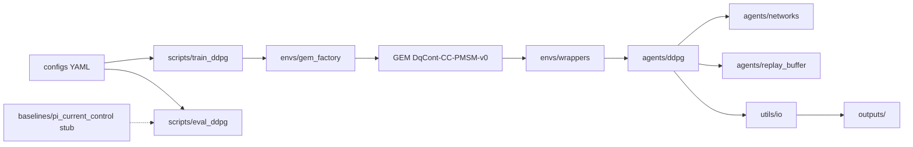

# Standalone PMSM RL current-control project (plan)

## Repository reality check

- The repo today is essentially **empty of implementation**: no discoverable `.py` sources beyond an empty [`agents/ddpg_agent.py`](d:\theses\pmsm_rl_current_control\agents\ddpg_agent.py); conventions live in [`.cursor/rules/project_rules.mdc`](d:\theses\pmsm_rl_current_control\.cursor\rules\project_rules.mdc).
- **GEM choice for milestone 1 (DDPG + continuous actions)**: use `gym_electric_motor.make("DqCont-CC-PMSM-v0", ...)` — documented as *dq continuous current-controlled PMSM* with `Box([-1,1]^2)` actions (dq voltages), references `i_sd`/`i_sq`, `tau=1e-4` by default (see upstream module docs for `DqContCurrentControlPermanentMagnetSynchronousMotorEnv`).
- **API caveat to handle in code (not invented)**: GEM historically mixed Gym/Gymnasium step signatures; current GEM is Gymnasium-oriented (`terminated`, `truncated`). The env factory + train/eval scripts will be written against **installed GEM** behavior (inspect `reset/step` signatures once deps are installed), with a thin compatibility shim only if strictly needed.

## Architecture (data flow)

## Files to create (exact list) and responsibilities

**Project root**

- [`pyproject.toml`](d:\theses\pmsm_rl_current_control\pyproject.toml) — Python 3.10+ project metadata; runtime deps: `gym-electric-motor`, `gymnasium`, `torch`, `numpy`, `pyyaml` (optional pin ranges after first install smoke test).
- [`requirements.txt`](d:\theses\pmsm_rl_current_control\requirements.txt) — mirror of installable deps for simple `pip install -r` workflows (keeps thesis repos reproducible without forcing Poetry).
- [`.gitignore`](d:\theses\pmsm_rl_current_control\.gitignore) — ignore `outputs/**`, `__pycache__/`, `.venv/`, Torch checkpoints unless you later choose to version small demos.

**`configs/`**

- [`configs/env_pmsm_cc.yaml`](d:\theses\pmsm_rl_current_control\configs\env_pmsm_cc.yaml) — GEM env id (`DqCont-CC-PMSM-v0`), kwargs to disable heavy visualization by default, optional `tau`/supply dict passthrough, random seed fields.
- [`configs/train_ddpg.yaml`](d:\theses\pmsm_rl_current_control\configs\train_ddpg.yaml) — DDPG hyperparameters (gamma, tau_polyak, lr_actor/critic, batch size, buffer capacity, warmup, max steps/episodes, eval cadence), device, log interval, output subdirectory name.

**`envs/`**

- [`envs/__init__.py`](d:\theses\pmsm_rl_current_control\envs\__init__.py) — export `make_train_env` / `make_eval_env` (thin public API).
- [`envs/gem_factory.py`](d:\theses\pmsm_rl_current_control\envs\gem_factory.py) — **only** constructs GEM envs via `import gym_electric_motor as gem` + `gem.make(...)`, merges YAML kwargs, ensures Gymnasium compatibility expectations are documented in docstrings.
- [`envs/wrappers.py`](d:\theses\pmsm_rl_current_control\envs\wrappers.py) — **only** transforms the GEM observation into a single `Box` vector for RL (concat normalized state vector + reference vector, dropping the tuple structure), and optionally exposes last-step debug scalars for logging. Keeps agents free of GEM-specific tuple handling.

**`agents/`**

- [`agents/__init__.py`](d:\theses\pmsm_rl_current_control\agents\__init__.py) — export `DDPGAgent` (or package-level imports).
- [`agents/networks.py`](d:\theses\pmsm_rl_current_control\agents\networks.py) — small MLP **Actor** (obs → `tanh` action in `[-1,1]^2`) and **Critic** (obs+act → scalar Q); no training logic here.
- [`agents/replay_buffer.py`](d:\theses\pmsm_rl_current_control\agents\replay_buffer.py) — classic fixed-size replay: `push`, `sample`, optional `__len__`; numpy/torch tensors with dtypes aligned to Torch training.
- [`agents/ddpg.py`](d:\theses\pmsm_rl_current_control\agents\ddpg.py) — **DDPG mechanics only**: target nets, soft updates, `select_action` (+ exploration noise), `learn(batch)` performing actor/critic/target updates. No filesystem I/O here.
- **Disposition of existing** [`agents/ddpg_agent.py`](d:\theses\pmsm_rl_current_control\agents\ddpg_agent.py): either delete it to avoid duplicate “DDPG entrypoints”, or replace with a 5–10 line **deprecated shim** re-exporting `DDPGAgent` from `agents/ddpg.py` (preference: **shim** if you want that filename to keep opening cleanly in your IDE).

**`baselines/`**

- [`baselines/__init__.py`](d:\theses\pmsm_rl_current_control\baselines\__init__.py) — export `PICurrentController`.
- [`baselines/pi_current_control.py`](d:\theses\pmsm_rl_current_control\baselines\pi_current_control.py) — **stub milestone**: class with stable interface `reset()` and `compute_action(obs: np.ndarray) -> np.ndarray` returning a safe placeholder (e.g., zeros in the env’s action space shape) plus TODO hooks for future dq-frame PI gains / anti-windup. No GEM dependency required inside the stub.

**`utils/`**

- [`utils/__init__.py`](d:\theses\pmsm_rl_current_control\utils\__init__.py)
- [`utils/seed.py`](d:\theses\pmsm_rl_current_control\utils\seed.py) — seed `random`, `numpy`, `torch`, and (if applicable) GEM/Gymnasium RNGs via env reset seeds.
- [`utils/config.py`](d:\theses\pmsm_rl_current_control\utils\config.py) — tiny YAML loader + dotdict/plain dict merge helper (keeps scripts dumb).
- [`utils/io.py`](d:\theses\pmsm_rl_current_control\utils\io.py) — checkpoint save/load for actor/critic/optimizers + training step counter (Torch `state_dict`s).

**`outputs/`**

- [`outputs/.gitkeep`](d:\theses\pmsm_rl_current_control\outputs\.gitkeep) — ensures folder exists; all runs write beneath `outputs/<run_name>/...`.

**`scripts/`**

- [`scripts/train_ddpg.py`](d:\theses\pmsm_rl_current_control\scripts\train_ddpg.py) — **minimal runnable milestone**: load YAMLs, seed, build wrapped env, instantiate networks+buffer+agent, run episodes/steps loop with `terminated/truncated`, periodic eval rollouts, checkpointing to `outputs/`.
- [`scripts/eval_ddpg.py`](d:\theses\pmsm_rl_current_control\scripts\eval_ddpg.py) — load checkpoint, run N deterministic episodes on wrapped env, print/CSV aggregate metrics (mean return, mean tracking error proxy from logged features if available).

**Optional (only if you want a true “package import” story; not required for milestone scripts)**

- [`pmsm_rl/__init__.py`](d:\theses\pmsm_rl_current_control\pmsm_rl\__init__.py) — namespace package version tag. **If you prefer flat imports** (`import envs...`) you can skip this and run scripts with `PYTHONPATH=.` (documented in README at implementation time).

## Order of implementation (strict sequence)

1. **Dependencies + skeleton**: `pyproject.toml`, `requirements.txt`, `.gitignore`, all `__init__.py`, `outputs/.gitkeep`.
2. **Config plumbing**: `utils/config.py`, `configs/env_pmsm_cc.yaml`, `configs/train_ddpg.yaml`.
3. **Environment layer (GEM)**: `envs/gem_factory.py` then `envs/wrappers.py` then `envs/__init__.py` exports; smoke-import `gem.make("DqCont-CC-PMSM-v0")` and verify `reset/step` observation type/shape.
4. **Utilities used everywhere else**: `utils/seed.py`, `utils/io.py`.
5. **RL core modules**: `agents/replay_buffer.py` → `agents/networks.py` → `agents/ddpg.py` → `agents/__init__.py` (+ optional shim for `agents/ddpg_agent.py`).
6. **Baseline stub**: `baselines/pi_current_control.py` (+ `baselines/__init__.py`).
7. **Training entrypoint**: `scripts/train_ddpg.py` (short file: loops live here, not inside `DDPGAgent`).
8. **Evaluation entrypoint**: `scripts/eval_ddpg.py`.
9. **End-to-end verification**: short run (few hundred steps) + deterministic eval; tighten default YAML values only after it runs.

## Explicit non-goals for milestone 1 (keeps files small)

- No distributed training, no prioritized replay, no sweeps, no plotting pipeline (can be milestone 2).
- No “smart” PI tuning inside the baseline stub—only interface + placeholder action.
